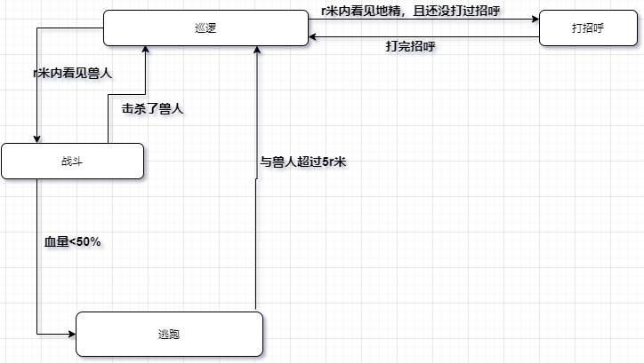
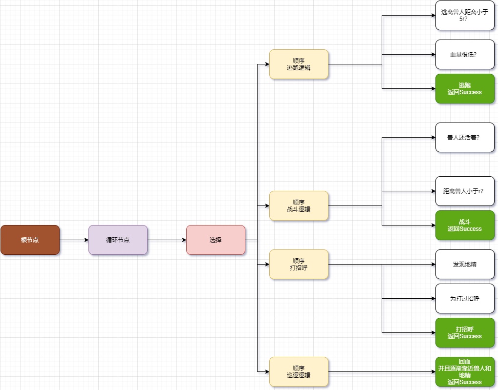

（TSS）Task Switch Structure 一种任务切换结构，它包含**有限状态机（FSM）**和**行为树（BT）**
	在实际开发中尤其在游戏开发中，我们通常需要给角色添加自动化机制，为了让角色的自动化行为不至于太蠢，我们还需要让角色根据实际情况做出合理的反应。这一些列问题总结下来就是：“我接下来该做什么？”。每一个角色每时每刻都应该结合自身所能获取的一切数据信息不断的问自己我接下来要做什么？相同的很多角色在一个场景中，不同身份的角色有着各自不同的数据权限，还有不同的目标，角色的行为又会让场景中的数据发生变化，以此整个场景就会合理动态的运转起来。构建出这样一个场景不是一件容易的事情。

为了能更好的把合理的自动行为机制组织起来，介绍两种TSS的结构，有限状态机和行为树，他们完全不同，各有优缺点，接下来会一一介绍。
  我想用两种方式去分别实现一组TSS，来看一下各自在实现起来有什么不同。

  实现一下这样的一种行为，一个步兵的巡逻和预警逻辑：步兵在一个半径为R米的圆内巡逻，在视线r米范围内遇到地精，他会和对方打招呼，当在r米的视线范围内看到兽人时，他会冲上去战斗，如果自己血量低于50%就会逃跑。当逃跑一段距离后（超过5倍视线后）他会再次进入巡逻状态。
##### FSM: 有限状态机（Finite State Machine）
优点：简单，直接，易实现。
缺点：不能很好的处理新加入的状态，可扩展性不够好。

在有限多个状态之间，当状态与状态之间的切换条件满足即可切换。可以想象一个状态有多个转换条件指向不同的状态，转换条件的排列顺序其实很重要，他决定了该状态会优先响应哪一种变化。例如在上述步兵的例子中，当步兵在巡逻的过程中与兽人战斗这个转换条件应该排在与地精打招呼之前（如果他是一个正经的战士），下面来看一下状态图


首先需要定义4中状态的枚举
打招呼--SayHi
巡逻--Patrol
战斗--Battle
逃跑--Escape

另外我想用一种声明式的方式去设计FSM框架，这种形式可以做到代码简洁层次清晰。

```csharp
enum State
{
    SayHi,//打招呼
    Patrol,//巡逻
    Battle,//战斗
    Escape//逃跑
}
```
```csharp
            // Create a state machine
            var machine = new StateMachine<State>();
            const int r = 5;
            bool sayHiComplete = false;
            int hp = 10;
            int orcHp = 20;
            int distanceBetweenOrc = 10;
            int distanceBetweenGoblin = 12;
            machine
                .NewState(State.Patrol)
                    .Initialize(() => Console.WriteLine("Init Patral State"))
                    .Enter(() => Console.WriteLine("Enter Patral State"))
                    .Update(() =>
                    {
                        distanceBetweenOrc--;
                        distanceBetweenGoblin--;
                        hp++;
                        Console.WriteLine($"Patral ING.... distanceBetweenOrc:{distanceBetweenOrc} distanceBetweenGobin:{distanceBetweenGoblin} Hp:{hp} orcHp:{orcHp}");
                    })
                    .Translate(() => distanceBetweenOrc < r && orcHp>0).To(State.Battle)
                    .Translate(() => distanceBetweenGoblin < r&&!sayHiComplete).To(State.SayHi)
                .End()
                .NewState(State.Battle)
                    .Initialize(() => Console.WriteLine("Init Battle State"))
                    .Enter(() => Console.WriteLine("Enter Battle State"))
                    .Update(() =>
                    {
                        hp--;
                        orcHp--;
                        Console.WriteLine("Fight ING.... Current HP " + hp+" ocrHp "+orcHp);
                    })
                    .Translate(() => hp < 5).To(State.Escape)
                    .Translate(()=> orcHp < 0).To(State.Patrol)
                .End()
                .NewState(State.Escape)
                    .Initialize(() => Console.WriteLine("Init Escape State"))
                    .Enter(() => Console.WriteLine("Enter Escape State"))
                    .Update(() =>
                    {
                        distanceBetweenOrc++;
                        distanceBetweenGoblin++;
                        Console.WriteLine($"Escape ING.... distanceBetweenOrc:{distanceBetweenOrc} distanceBetweenGobin:{distanceBetweenGoblin} Hp:{hp} orcHp:{orcHp}");
                    })
                    .Translate(() => distanceBetweenOrc > 5 * r).To(State.Patrol)
                .End()
                .NewState(State.SayHi)
                    .Initialize(() => Console.WriteLine("Init SayHi State"))
                    .Enter(() => Console.WriteLine("Enter SayHi State"))
                    .Update(() =>
                    {
                        sayHiComplete = true;
                        Console.WriteLine("Say Hi to Goblin");
                    })
                    .Translate(() => sayHiComplete).To(State.Patrol)
                .End()
                .Initialize()
                .Start(State.Patrol);

            // update machine
            bool running = true;
            ThreadPool.QueueUserWorkItem(_ => { var key = Console.ReadKey(); running = false; });
            while (running)
            {
                machine.Update();
                Thread.Sleep(100);
            }
            Console.WriteLine(Guid.NewGuid().ToString());
       
            machine.Stop();
            Console.WriteLine("FSM Stop");

```

这是一个控制台程序，上述代码描述的行为在经过一段时间执行后结果是如下这样的，因为本示例中在击杀完兽人之后不会有其他兽人进来，因此步兵最后的状态是一直巡逻。我们来看看日志吧。
```log
Init Patral State
Init Battle State
Init Escape State
Init SayHi State
Enter Patral State
Patral ING.... distanceBetweenOrc:9 distanceBetweenGobin:11 Hp:11 orcHp:20
Patral ING.... distanceBetweenOrc:8 distanceBetweenGobin:10 Hp:12 orcHp:20
Patral ING.... distanceBetweenOrc:7 distanceBetweenGobin:9 Hp:13 orcHp:20
Patral ING.... distanceBetweenOrc:6 distanceBetweenGobin:8 Hp:14 orcHp:20
Patral ING.... distanceBetweenOrc:5 distanceBetweenGobin:7 Hp:15 orcHp:20
Patral ING.... distanceBetweenOrc:4 distanceBetweenGobin:6 Hp:16 orcHp:20
Enter Battle State
Fight ING.... Current HP 15 ocrHp 19
Fight ING.... Current HP 14 ocrHp 18
Fight ING.... Current HP 13 ocrHp 17
Fight ING.... Current HP 12 ocrHp 16
Fight ING.... Current HP 11 ocrHp 15
Fight ING.... Current HP 10 ocrHp 14
Fight ING.... Current HP 9 ocrHp 13
Fight ING.... Current HP 8 ocrHp 12
Fight ING.... Current HP 7 ocrHp 11
Fight ING.... Current HP 6 ocrHp 10
Fight ING.... Current HP 5 ocrHp 9
Fight ING.... Current HP 4 ocrHp 8
Enter Escape State
Escape ING.... distanceBetweenOrc:5 distanceBetweenGobin:7 Hp:4 orcHp:8
Escape ING.... distanceBetweenOrc:6 distanceBetweenGobin:8 Hp:4 orcHp:8
Escape ING.... distanceBetweenOrc:7 distanceBetweenGobin:9 Hp:4 orcHp:8
Escape ING.... distanceBetweenOrc:8 distanceBetweenGobin:10 Hp:4 orcHp:8
Escape ING.... distanceBetweenOrc:9 distanceBetweenGobin:11 Hp:4 orcHp:8
Escape ING.... distanceBetweenOrc:10 distanceBetweenGobin:12 Hp:4 orcHp:8
Escape ING.... distanceBetweenOrc:11 distanceBetweenGobin:13 Hp:4 orcHp:8
Escape ING.... distanceBetweenOrc:12 distanceBetweenGobin:14 Hp:4 orcHp:8
Escape ING.... distanceBetweenOrc:13 distanceBetweenGobin:15 Hp:4 orcHp:8
Escape ING.... distanceBetweenOrc:14 distanceBetweenGobin:16 Hp:4 orcHp:8
Escape ING.... distanceBetweenOrc:15 distanceBetweenGobin:17 Hp:4 orcHp:8
Escape ING.... distanceBetweenOrc:16 distanceBetweenGobin:18 Hp:4 orcHp:8
Escape ING.... distanceBetweenOrc:17 distanceBetweenGobin:19 Hp:4 orcHp:8
Escape ING.... distanceBetweenOrc:18 distanceBetweenGobin:20 Hp:4 orcHp:8
Escape ING.... distanceBetweenOrc:19 distanceBetweenGobin:21 Hp:4 orcHp:8
Escape ING.... distanceBetweenOrc:20 distanceBetweenGobin:22 Hp:4 orcHp:8
Escape ING.... distanceBetweenOrc:21 distanceBetweenGobin:23 Hp:4 orcHp:8
Escape ING.... distanceBetweenOrc:22 distanceBetweenGobin:24 Hp:4 orcHp:8
Escape ING.... distanceBetweenOrc:23 distanceBetweenGobin:25 Hp:4 orcHp:8
Escape ING.... distanceBetweenOrc:24 distanceBetweenGobin:26 Hp:4 orcHp:8
Escape ING.... distanceBetweenOrc:25 distanceBetweenGobin:27 Hp:4 orcHp:8
Escape ING.... distanceBetweenOrc:26 distanceBetweenGobin:28 Hp:4 orcHp:8
Enter Patral State
Patral ING.... distanceBetweenOrc:25 distanceBetweenGobin:27 Hp:5 orcHp:8
Patral ING.... distanceBetweenOrc:24 distanceBetweenGobin:26 Hp:6 orcHp:8
Patral ING.... distanceBetweenOrc:23 distanceBetweenGobin:25 Hp:7 orcHp:8
Patral ING.... distanceBetweenOrc:22 distanceBetweenGobin:24 Hp:8 orcHp:8
Patral ING.... distanceBetweenOrc:21 distanceBetweenGobin:23 Hp:9 orcHp:8
Patral ING.... distanceBetweenOrc:20 distanceBetweenGobin:22 Hp:10 orcHp:8
Patral ING.... distanceBetweenOrc:19 distanceBetweenGobin:21 Hp:11 orcHp:8
Patral ING.... distanceBetweenOrc:18 distanceBetweenGobin:20 Hp:12 orcHp:8
Patral ING.... distanceBetweenOrc:17 distanceBetweenGobin:19 Hp:13 orcHp:8
Patral ING.... distanceBetweenOrc:16 distanceBetweenGobin:18 Hp:14 orcHp:8
Patral ING.... distanceBetweenOrc:15 distanceBetweenGobin:17 Hp:15 orcHp:8
Patral ING.... distanceBetweenOrc:14 distanceBetweenGobin:16 Hp:16 orcHp:8
Patral ING.... distanceBetweenOrc:13 distanceBetweenGobin:15 Hp:17 orcHp:8
Patral ING.... distanceBetweenOrc:12 distanceBetweenGobin:14 Hp:18 orcHp:8
Patral ING.... distanceBetweenOrc:11 distanceBetweenGobin:13 Hp:19 orcHp:8
Patral ING.... distanceBetweenOrc:10 distanceBetweenGobin:12 Hp:20 orcHp:8
Patral ING.... distanceBetweenOrc:9 distanceBetweenGobin:11 Hp:21 orcHp:8
Patral ING.... distanceBetweenOrc:8 distanceBetweenGobin:10 Hp:22 orcHp:8
Patral ING.... distanceBetweenOrc:7 distanceBetweenGobin:9 Hp:23 orcHp:8
Patral ING.... distanceBetweenOrc:6 distanceBetweenGobin:8 Hp:24 orcHp:8
Patral ING.... distanceBetweenOrc:5 distanceBetweenGobin:7 Hp:25 orcHp:8
Patral ING.... distanceBetweenOrc:4 distanceBetweenGobin:6 Hp:26 orcHp:8
Enter Battle State
Fight ING.... Current HP 25 ocrHp 7
Fight ING.... Current HP 24 ocrHp 6
Fight ING.... Current HP 23 ocrHp 5
Fight ING.... Current HP 22 ocrHp 4
Fight ING.... Current HP 21 ocrHp 3
Fight ING.... Current HP 20 ocrHp 2
Fight ING.... Current HP 19 ocrHp 1
Fight ING.... Current HP 18 ocrHp 0
Fight ING.... Current HP 17 ocrHp -1
Enter Patral State
Patral ING.... distanceBetweenOrc:3 distanceBetweenGobin:5 Hp:18 orcHp:-1
Patral ING.... distanceBetweenOrc:2 distanceBetweenGobin:4 Hp:19 orcHp:-1
Enter SayHi State
Say Hi to Goblin
Enter Patral State
Patral ING.... distanceBetweenOrc:1 distanceBetweenGobin:3 Hp:20 orcHp:-1
Patral ING.... distanceBetweenOrc:0 distanceBetweenGobin:2 Hp:21 orcHp:-1
Patral ING.... distanceBetweenOrc:-1 distanceBetweenGobin:1 Hp:22 orcHp:-1
Patral ING.... distanceBetweenOrc:-2 distanceBetweenGobin:0 Hp:23 orcHp:-1
Patral ING.... distanceBetweenOrc:-3 distanceBetweenGobin:-1 Hp:24 orcHp:-1
Patral ING.... distanceBetweenOrc:-4 distanceBetweenGobin:-2 Hp:25 orcHp:-1
Patral ING.... distanceBetweenOrc:-5 distanceBetweenGobin:-3 Hp:26 orcHp:-1
Patral ING.... distanceBetweenOrc:-6 distanceBetweenGobin:-4 Hp:27 orcHp:-1
Patral ING.... distanceBetweenOrc:-7 distanceBetweenGobin:-5 Hp:28 orcHp:-1
......
```
可以看到步兵在切换状态的过程中满足我们既定的想法，步兵的确做到了他该做到的。代码中用到的一些变量在实际项目中会以黑板数据的形式提供，有状态机的角色共同享有这些数据的访问权和修改权。
##### BT: 行为树 （Behaviour Tree）
优点：扩展性比状态机好，能处理更多复杂情况。
缺点：不直接，难度大，实现起来困难。

首先需要解释一下各个节点的含义：
 

一棵行为树的根节点，有且只有一个。并且根的子节点最多只有一个。

 

一种Decorator节点，该类型的节点起到控制流程的作用。循环节点也是其中一种派生类型，该类型的节点也只有一个子节点。还有很多节点也是Decorator的子类，他们有取反，循环直至，返回Success，返回Failure等待。

 

一种Composite节点，选择节点也是其中一种派生类型，该类型的节点可以包含多个子节点，以选择节点为例，该子节点的执行过程会受到当前节点的制约，当有一个子节点返回Success的时候不再继续执行子节点了。

 

一种Composite节点，顺序节点也是其中一种派生类型，该类型的节点可以包含多个子节点，以顺序节点为例，该子节点的执行过程会受到当前节点的制约，当有一个子节点返回Failure的时候不再继续执行子节点了。

 

一种Action节点，该节点没有子节点，需要实现判定逻辑以提供父节点决定是否需要执行后续节点。

 

一种Action节点，该节点没有子节点，主要实现逻辑行为。


根据步兵和行为可以列出行为树结构如下图：




同样的根据行为树的结构，用代码实现如下

```csharp
            BehaviourTree tree = new BehaviourTree();
            const int r = 5;
            bool sayHiComplete = false;
            int hp = 10;
            int orcHp = 20;
            int distanceBetweenOrc = 10;
            int distanceBetweenGoblin = 12;

            tree.Builder
                .Repeat()
                    .Select()
                        .Sequence()
                            .Do()
                                .Start(() => Console.WriteLine("far way 5r from orc"))
                                .GetResult(() =>
                                {
                                    if (distanceBetweenOrc <= 5 * r)
                                        return Node.NodeResult.Success;
                                    return Node.NodeResult.Failure;
                                })
                            .End()
                            .Do()
                                .Start(() => Console.WriteLine("Hp is low?"))
                                .GetResult(() =>
                                {
                                    if (hp < 5)
                                        return Node.NodeResult.Success;
                                    return Node.NodeResult.Failure;
                                })
                            .End()
                            .Do()
                                .Start(() => Console.WriteLine("Yes ,Hp is low"))
                                .Update(() =>
                                {
                                    distanceBetweenGoblin++;
                                    distanceBetweenOrc++;
                                    ShowDetails();
                                })
                                .GetResult(() =>
                                {
                                    return Node.NodeResult.Success;
                                })
                            .End()
                        .End()
                        .Sequence()
                            .Do()
                                .Start(()=>Console.WriteLine("Orc is alive?"))
                                .GetResult(() =>
                                {
                                    if (orcHp > 0)
                                        return Node.NodeResult.Success;
                                    return Node.NodeResult.Failure;
                                })
                            .End()
                            .Do()
                                .Start(() => Console.WriteLine("Orc is near?"))
                                .GetResult(() =>
                                {
                                    if (distanceBetweenOrc < r)
                                        return Node.NodeResult.Success;
                                    return Node.NodeResult.Failure;
                                })
                            .End()
                            .Do()
                                .Start(() => Console.WriteLine("Yes, Orc is near"))
                                .Update(() =>
                                {
                                    hp--;
                                    orcHp--;
                                    ShowDetails();
                                })
                                .GetResult(() =>
                                {
                                    return Node.NodeResult.Success;
                                })
                            .End()
                        .End()
                        .Sequence()
                            .Do()
                                .Start(() => Console.WriteLine("Goblin is near?"))
                                .GetResult(() =>
                                {
                                    if (distanceBetweenGoblin < r)
                                        return Node.NodeResult.Success;
                                    return Node.NodeResult.Failure;
                                })
                            .End()
                            .Do()
                                .Start(() => Console.WriteLine("Has said hi?"))
                                .GetResult(() =>
                                {
                                    if (!sayHiComplete)
                                        return Node.NodeResult.Success;
                                    return Node.NodeResult.Failure;
                                })
                            .End()
                            .Do()
                                .Start(() => Console.WriteLine("Say Hi"))
                                .Update(() =>
                                {
                                    sayHiComplete = true;
                                    Console.WriteLine("Say Hi to Gobin!!");
                                    ShowDetails();
                                })
                                .GetResult(() => Node.NodeResult.Success)
                            .End()
                        .End()
                        .Sequence()
                            .Do()
                                .Start(() => Console.WriteLine("hp++"))
                                .Update(() =>
                                {
                                    distanceBetweenGoblin--;
                                    distanceBetweenOrc--;
                                    hp++;
                                    ShowDetails();
                                })
                                .GetResult(() => Node.NodeResult.Success)
                            .End()
                        .End()
                    .End()
                .End();

            void ShowDetails()
            {
                Console.WriteLine($"Hp {hp} OrcHp {orcHp} DistOrc {distanceBetweenOrc} DistGobin {distanceBetweenGoblin} Has Say Hi {sayHiComplete}");
            }

            while (true)
            {
                tree.Execute();
                Thread.Sleep(100);
            }
```
##### 结论
可以看到FSM的结构还是比较清晰的，感觉起来FSM处理问题更加直观便利。行为树在实现起来还是比较困难的，理清思路是第一步。两种方式都是很不错的任务切换结构，具体使用哪一种还是需要具体问题具体分析。