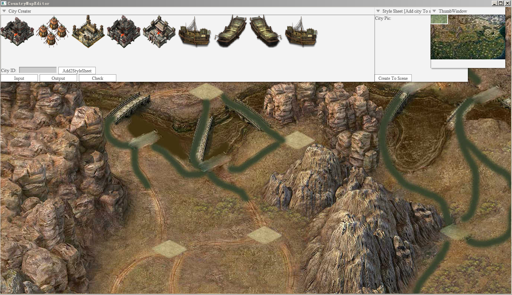
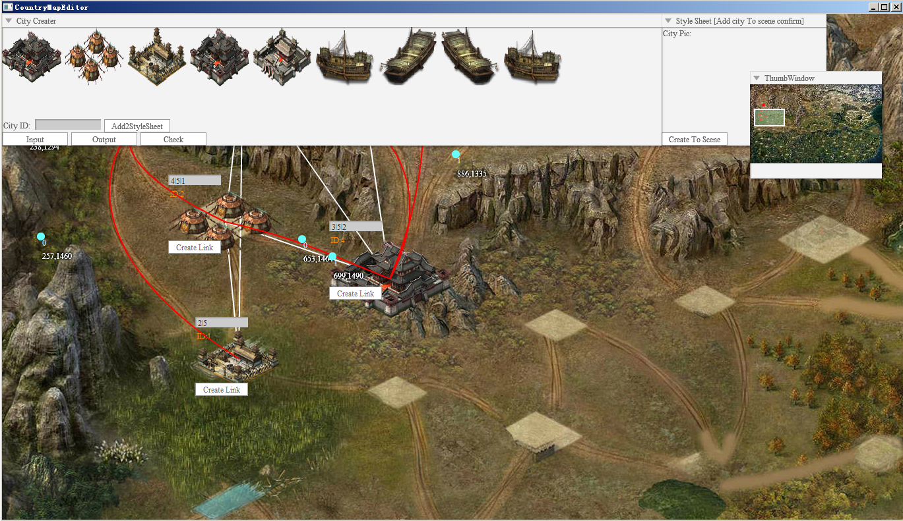
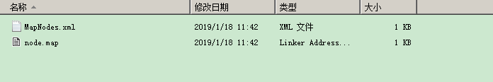
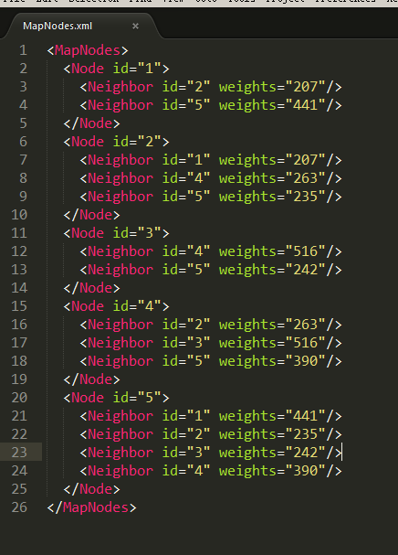

经典的SLG游戏都离不开国战的玩法，尤其以三国类题材居多，我在几年前有幸参与了一款经典的三国类SLG游戏的开发，其中的国战玩法相当典型。包含这几点元素：

\#1大地图（整个中国版图相当宏伟）；

\#2城池数量庞大城与城之间包含复杂的连接组成庞大的城市网络；

\#3路线的曲线各种各样；

\#4丰富的地形设计；

\#5单个城池的信息复杂多样；

 

那么该如何将这么多复杂的信息整合在一起呢，毕竟光200多个的城池详细信息要让策划录入配置表就已经是一件不可能完成的事情了，考虑到效率和人文关怀。我为策划同事们开发了一款国战大底图编辑器。这个编辑器现在可以在我的网盘中[下载](https://pan.baidu.com/s/1pzNFkzji9gr-Fuu4hDaQLA)（979s）。

 

**我设计编辑器的主要功能还是便于策划和我们程序开发，因此可视化所见所得是必须的，当我们打开CountryMapEditor.exe的时候，界面是这样的：**

这个界面中的大地图铺面了整个场景，缩略图窗口显示出当前的视窗位置：位于整个大地图的西北角，如此大的地图素材，需要在打开游戏或编辑器的时候对地图进行分块裁切，这部分工作在另外的工具中已经完成了，所有的地图分块保存着工具目录的asset目录下（这里把大地图切成了100块相同尺寸的数据块）待程序启动根据当前视窗大小和位置与数据分块中记录的数据比较进而选择加载适当的分块数据。这点也一些地图app类似。

地图数据的加载与释放同样都很重要，这与性能息息相关。在视窗远离某些分块时候做适当的数据释放，这点很重要。

 

接下来的这一步是编辑城池：

我在这里已经编辑了一些城池，从上图我们可以看到城池与城池之间的红色贝塞尔曲线就是他们之间的道路，**用两个点可以调整贝塞尔曲线的曲率，使得曲线与地面道路尽可能贴合，这样单条贝塞尔曲线的点集合M描述了城池A与城池B之间的路径长度或者说是权重，记为M｛A,B｝ = Value；Value值就是点与点之间的长度和，**这个Value很重要，它将在迪杰斯特拉算法中充当权重的角色，因此这个值不光前端需要，后端也需要这个值。在实际游戏中某个城池会出现毁坏状态，此时经过这个城池的所有道路将处于失效状态。这个时候也可以通过修改权重达到效果。

 

我们编辑完成后可以点击Output按钮这样我们就把数据保存了下来；我们去找一下MapNode文件夹

如图所示，文件夹内有两个文件，其中xml文件简单明了

 

将所有的关系都已经列举了出来，这种配置文件信息后端很需要，另外一个二进制文件是前端用的，里面不止包含了xml中的信息还有一些其他敏感数据信息。

 

到这里这个国战编辑器就算完成了，这部分的工作使得策划可以更安心的处理游戏细节，而不必受困于生产工具。需要项目工程的可以联系我。